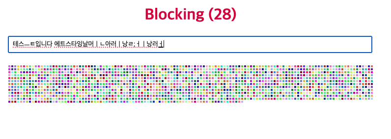

# useTransition

# useTransition

### useTransition의 개념

- useTransition 리액트 공식 문서의 서술
    
    `useTransition은 UI의 일부를 백그라운드에서 렌더링 할 수 있도록 해주는 React Hook입니다.` 
    
    `const [isPending, startTransition] = useTransition()` 
    
- useTransition이란
    - ui의 non-blocking 상태로 state 업데이트를 관리할 수 있는 react hook이다. 비동기 작업이나 복잡한 계산을 실행할 때 유효하다.
    - `isPending` : 대기 중인 transition이 있는지 여부를 알려준다.
    - `startTransition` : 상태 업데이트를 transition으로 표시할 수 있다.
    
    간단한 예시는 다음과 같다.
    
    ```jsx
    function TabContainer() {
      const [isPending, startTransition] = useTransition();
      const [tab, setTab] = useState('about');
    
      function selectTab(nextTab) {
        startTransition(() => {
          setTab(nextTab);
        });
      }
      // ...
    }
    ```
### useTransition은 왜 필요한가?

- 인터렉션에 대한 업데이트와 사용자 경험 향상
    - 화면을 랜더링하는 연산이 무거워지면 사용자가 체감할 수 있는 이벤트의 지연이 발생할 수 있다.
    - Blocking 예시 확인이 가능한 사이트
        
        https://ajaxlab.github.io/deview2021/blocking/
        
        
        
    - 사용자 입력에 따라 화면을 랜더링하는 예시로 화면이 랜더링 됨에 따라 keypress가 지연되는 것을 확인할 수 있다.
- 따라서 리액트 18에서 동시성 기능을 구현하고자 했다.
    - 동시성(Concurrent) vs 병렬성(Parallelism)
        - 동시성은 독립적으로 실행되는 프로세스들의 조합이다.
        - 병렬성은 연관된 복수의 연산들을 동시에 실행하는 것이다.
        - 즉, 동시성은 병렬처리가 가능해보이지만 실제 병렬처리는 아니다.
    - 자바스크립트 엔진은 단일 스레드로 작동한다. 이는 리액트 랜더링 연산도 동일하다.
        - 따라서 우선순위를 통해 랜더링을 진행하게 된다.
        - react18 이전까지는 발생시간/만료시간 등을 기준으로 우선순위를 부여하였다.
        - react18부터 우선순위 부여를 위한 인터페이스를 개발하여 제공하고 있다.

### React에서 정의하는 Transition의 개념

- React에서는 상태 업데이트를 두 가지 범주로 나눌 수 있다.
    - **긴급 업데이트(Urgent updates)**: 입력, 클릭, 키 누르기 등 **직접적인 사용자 상호작용**을 반영하는 업데이트
    - **트랜지션 업데이트(Transition updates)**: **UI가 한 상태에서 다른 상태로 전환**될 때 발생하는 업데이트
    - 긴급 업데이트는 사용자의 물리적 행동에 대한 즉각적인 반응이 필요하다. 반응이 느리거나 지연되면 “이상하다”는 느낌을 주기 때문이다.
    - 반면 트랜지션 업데이트는 사용자가 **모든 중간 상태를 반드시 즉시 볼 것이라고 기대하지 않는다**. 예를 들어 드롭다운에서 필터를 선택할 때, 사용자는 **필터 버튼 자체는 즉시 반응하길 기대**하지만, **필터 결과는 약간의 지연이 있어도 괜찮다고 느낀다.**
        - 심지어 결과가 아직 렌더링되기 전에 다른 필터를 다시 선택한다면, 사용자는 이전 결과 대신 **가장 최신 결과만 보고 싶어 한다.**
- 일반적인 React 앱에서는 대부분의 상태 업데이트가 개념적으로는 트랜지션에 해당한다.
    - 그러나 **이전 버전과의 호환성**을 유지하기 위해 React 18에서도 모든 업데이트는 기본적으로 긴급하게 처리하고 있다. 따라서 개발자가 어떤 업데이트를 트랜지션으로 처리하고자 할 때는 **`startTransition`으로 직접 감싸서 표시해야 한다.**

    
### 실질적인 예시를 통해 각각의 역할을 알아보기
    
  ```jsx
  import { useState, useTransition } from 'react';
  
  function SearchComponent() {
    const [query, setQuery] = useState('');
    const [results, setResults] = useState([]);
    const [isPending, startTransition] = useTransition();
  
    const handleChange = (e) => {
      // 높은 우선순위
      setQuery(e.target.value);
      
      // 낮은 우선순위
      startTransition(() => {
        const searchResults = performSearch(e.target.value);
        setResults(searchResults);
      });
    };
  
    return (
      <>
        <input value={query} onChange={handleChange} />
        {isPending ? (
          <p>검색 중...</p>
        ) : (
          <ul>
            {results.map(item => <li key={item.id}>{item.name}</li>)}
          </ul>
        )}
      </>
    );
  }
  ```

위의 예시는 `<input>`에 검색어를 입력하고, `performSearch` 를 통해 검색하는 작업을 의미한다.

여기서 `performSearch` 는 위에서 언급한 “복잡한 계산”의 예시로 볼 수 있다.

### 순차적으로 사용자가 ‘a’, ‘ab’, ‘abc’를 입력했을 때의 단계별 화면 변경사항에 대해 살펴보자.

1. **‘a’ 입력 시**
    
    `handleChange`가 호출된다. 이때 높은 우선순위를 가진 `setQuery('a')`가 실행된다. input 값이 ‘a’로 업데이트되면서 사용자 화면에도 바로 반영된다.
    
    동시에 낮은 우선순위의 `startTransition`도 시작된다. `isPending`은 `true`로 바뀌고 로딩 메시지가 나타난다. 이 상태에서 `performSearch(e.target.value)`가 호출된다.
    
2. **‘ab’를 빠르게 입력했다. 즉, 기존의 ‘a’에 ‘b’를 하나 더 입력하여 ‘ab’가 되었다.**
    
    `handleChange`가 다시 호출된다. `setQuery('ab')`가 실행되어 input 값이 ‘ab’로 즉시 업데이트된다.
    
    이때 기존의 ‘a’에 대한 transition은 무효화되고 새로운 `startTransition`이 실행된다. `isPending`은 여전히 `true` 상태를 유지하므로 화면에는 로딩 메시지가 계속 표시된다.
    
3. **사용자가 타이핑을 멈췄다. (‘ab’에서 더 이상 변화가 일어나지 않는다)**
    
    브라우저가 여유 시간을 감지하고, 실제로 `performSearch`를 실행한다. 실행이 완료되면 `isPending`은 `false`가 되고 결과 목록이 화면에 렌더링된다.
    


### startTransition(action) 구조 살펴보기

- `startTransition`은 `action` 함수를 파라미터로 받는다. 이 함수는 `set` 함수를 포함해 상태를 업데이트하는 작업을 수행한다.
- `startTransition`은 매개변수 없이 즉시 `action`을 실행하며, 함수 내의 동기적인 상태 업데이트들을 모두 transition으로 처리한다.
- 반환값은 없다.
- 내부에서 비동기 호출이 가능하다. 단, `await` 이후의 `set` 함수 호출은 별도의 `startTransition`으로 감싸야 정상 작동한다.

```jsx
startTransition(async () => {
  await someAsyncFunction();
  // 아래는 별도로 transition으로 감싸야 한다
  startTransition(() => {
    performSearch(e.target.value);
  });
});

```

- React는 `await` 이후의 상태 업데이트를 Transition으로 처리하지 않는다.
- 이는 JavaScript의 실행 컨텍스트(Execution Context) 구조 때문인데, `await` 이후 코드는 새로운 컨텍스트에서 실행되기 때문에 React가 transition 관련 정보를 이어받지 못한다.

### useTransition사용 시 유의점

- useTransition은 Hook이므로 컴포넌트나 커스텀 hook 내부에서만 호출 가능하다. 컴포넌트 외부에서 호출하려면 독립형 `startTransition` 을 호출해야 한다.
    - `startTransition` 의 경우 일반 함수이다. 따라서 전환 상태(`isPending` )를 반환하지 않는다. 단지 콜백 내부의 상태 업데이트를 비긴급으로 표기할 뿐이다.
- 해당하는 state의 set함수에 액세스할 수 있는 경우에만 업데이트를 transition으로 래핑 가능하다. prop이나 커스텀 Hook값에 대한 응답으로 transition을 시작하려면 `useDeferredValue` 를 사용해야 한다.
- `startTransition`에 전달한 함수는 즉시 실행된다. React는 이 함수를 즉시 실행하여 실행하는 동안 발생하는 모든 state 업데이트를 Transition으로 표기한다. 그러나 `setTimeout` 와 같이 현재 실행 스택이 완료 된 후 state 업데이트를 시도하는 함수는 Transition으로 표시되지 않는다.


## setTimeout과 startTransition의 관계 — 예제 분석

아래는 `startTransition` 내부에서 `setTimeout`을 사용하는 경우를 테스트한 예제입니다.

```jsx
'use client';

import { useState, useTransition, useEffect } from 'react';

export default function TimeoutWithTransition() {
  const [text, setText] = useState('초기값');
  const [isPending, startTransition] = useTransition();

  useEffect(() => {
    console.log('[isPending 상태] →', isPending);
  }, [isPending]);

  const handleClick = () => {
    startTransition(() => {
      console.log('[1] transition 시작');

      setTimeout(() => {
        console.log('[2] setTimeout 내부 진입');
        setText('setTimeout 이후 상태 업데이트');
      }, 100);

      console.log('[3] transition 함수 종료');
    });

    console.log('[4] handleClick 종료');
  };

  return (
    <div style={{ padding: 20 }}>
      <h2>Transition + setTimeout + isPending</h2>
      <button onClick={handleClick}>실행</button>
      <p>현재 텍스트: {text}</p>
      <p>isPending: {JSON.stringify(isPending)}</p>
    </div>
  );
}
[1] transition 시작
[3] transition 함수 종료
[4] handleClick 종료
[isPending 상태] → true
[isPending 상태] → false   ← transition 종료
(100ms 뒤)
[2] setTimeout 내부 진입   ← 별도 콜스택에서 실행됨

```

- 흐름 이해
    - **[1] transition 시작**
        
        `startTransition` 내부 코드가 실행되며, 이 시점에서 React는 작업을 transition으로 처리하기 시작. `isPending`은 `true`로 변경된다
        
    - **[3] transition 함수 종료**
        
        `startTransition` 블록의 동기 코드는 여기까지로 인식한다. `setTimeout`은 비동기 타이머로 등록만 된 상태이며, 아직 실행되지 않았다.
        
    - **[4] handleClick 종료**
        
        이벤트 핸들러 전체가 종료된다.
        
    - **[isPending 상태] → true**
        
        `useEffect`를 통해 `isPending`의 변경 사항을 추적한 결과이다. transition이 시작되었음을 나타낸다.
        
    - **[isPending 상태] → false**
        
        React는 transition 내부의 동기 작업이 끝났다고 판단하고, `isPending`을 `false`로 되돌립니다. 주의할 점은 이 시점에서도 `setTimeout`은 아직 실행되지 않았다는 것이다.
        
    - **[2] setTimeout 내부 진입**
        
        약 100ms 뒤, 타이머 콜백이 실행된다. 이 코드는 새로운 콜스택에서 실행되며 React의 transition 영역 밖에서 처리됩니다. 이로 인해 `setText()`는 일반적인 상태 업데이트로 간주되고, 다시 `isPending`이 `true`로 바뀌지는 않는다.
        
- 이해점
    - `startTransition()` 내부에서 등록한 `setTimeout()`의 콜백은 **transition 추적 대상이 아니다**
    - 따라서 `setTimeout()` 이후의 상태 업데이트는 React가 **transition의 일환으로 간주하지 않는다**
    - `isPending`은 `setTimeout` 실행 이전에 `false`로 돌아오며, 이후 실행되는 `setText()`는 transition 외부의 일반 업데이트이다
    
    ⇒ 이러한 특성은 `startTransition`이 동기적 실행 컨텍스트 내에서 상태 업데이트를 추적하기 때문에 발생한다. `await` 이후나 타이머 내부처럼 **React의 추적 컨텍스트 밖**으로 벗어나는 코드는 별도의 transition 블록으로 감싸지 않는 한, non-blocking 렌더링의 이점을 얻을 수 없다.
    

---

### 참고 링크

- [https://mycodings.fly.dev/blog/2024-07-14-react-19-tutorial-1-usetransition-and-new-form-api](https://mycodings.fly.dev/blog/2024-07-14-react-19-tutorial-1-usetransition-and-new-form-api)
- [https://velog.io/@kyeun95/React-useTransition이란](https://velog.io/@kyeun95/React-useTransition%EC%9D%B4%EB%9E%80)
- [https://www.youtube.com/watch?v=N5R6NL3UE7I](https://www.youtube.com/watch?v=N5R6NL3UE7I)
- [https://medium.com/@lovleshpokra/react-19-how-to-use-usetransition-useoptimistic-and-useactionstatehooks-d77352c03128](https://medium.com/@lovleshpokra/react-19-how-to-use-usetransition-useoptimistic-and-useactionstatehooks-d77352c03128)
- [https://medium.com/@jakintemi/usetransition-react-19-25a7bb376818](https://medium.com/@jakintemi/usetransition-react-19-25a7bb376818)
- [https://d2.naver.com/helloworld/2690975](https://d2.naver.com/helloworld/2690975)
- [https://velog.io/@tnghgks/React-Concurrent-mode](https://velog.io/@tnghgks/React-Concurrent-mode)
- [https://jser.dev/2023-05-19-how-does-usetransition-work/](https://jser.dev/2023-05-19-how-does-usetransition-work/)
- [https://stackoverflow.com/questions/74993789/how-this-usetransition-hook-works-in-reactjs](https://stackoverflow.com/questions/74993789/how-this-usetransition-hook-works-in-reactjs)
- [https://velog.io/@happygyu/번역-React-스케줄러는-내부에서-어떻게-동작할까](https://velog.io/@happygyu/%EB%B2%88%EC%97%AD-React-%EC%8A%A4%EC%BC%80%EC%A4%84%EB%9F%AC%EB%8A%94-%EB%82%B4%EB%B6%80%EC%97%90%EC%84%9C-%EC%96%B4%EB%96%BB%EA%B2%8C-%EB%8F%99%EC%9E%91%ED%95%A0%EA%B9%8C)
- [https://stackoverflow.com/questions/35193867/react-non-blocking-rendering-of-big-chunks-of-data](https://stackoverflow.com/questions/35193867/react-non-blocking-rendering-of-big-chunks-of-data)
- [https://www.linkedin.com/pulse/blocking-vs-non-blocking-decoding-heart-efficient-reactjs-kalara-uyzaf/](https://www.linkedin.com/pulse/blocking-vs-non-blocking-decoding-heart-efficient-reactjs-kalara-uyzaf/)
- [https://ko.react.dev/reference/react/useTransition#react-doesnt-treat-my-state-update-after-await-as-a-transition](https://ko.react.dev/reference/react/useTransition#react-doesnt-treat-my-state-update-after-await-as-a-transition)
- [https://ko.react.dev/reference/react/startTransition](https://ko.react.dev/reference/react/startTransition)
- [https://github.com/reactjs/rfcs/pull/229](https://github.com/reactjs/rfcs/pull/229)
- [https://junilhwang.github.io/TIL/Javascript/Domain/Execution-Context/#\\_1-개념](https://junilhwang.github.io/TIL/Javascript/Domain/Execution-Context/#%5C%5C_1-%E1%84%80%E1%85%A2%E1%84%82%E1%85%A7%E1%86%B7)
- [https://jy-beak.tistory.com/181#01](https://jy-beak.tistory.com/181#01)
- https://youthfulhps.dev/react/react-concurrent-mode-01/#%EB%8F%99%EC%8B%9C%EC%84%B1-%EB%A9%94%EC%BB%A4%EB%8B%88%EC%A6%98-%EC%96%91%EB%B3%B4
- https://github.com/reactwg/react-18/discussions/41