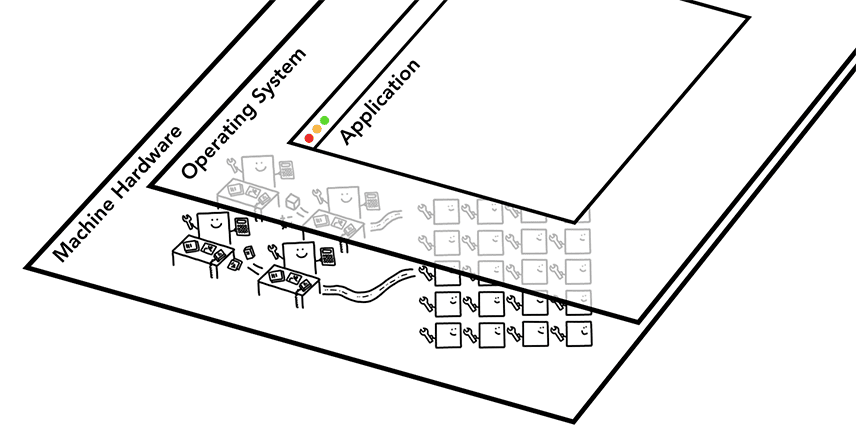

# 최신 웹브라우저 들여다보기 (1,2부)

## 기본 컴퓨팅 시스템에 대한 이해

### CPU & GPU

- CPU
    - (중앙프로세서)라고도 불림
    - 과거에는 단일 칩이었으나 현재는 2개 이상의 코어가 있는 경우가 많다.
    - CPU는 개별 단위로 동일한 기능을 가짐
- GPU
    - 그래픽처리 단위
    - 간단한 작업을 처리하는데 능숙하지만 코어가 여러개
    - 그래픽 처리를 목적으로 최초 개발
    - GPU 가속 컴퓨팅을 통해 더 많은 계산이 가능해짐

→ 일반적으로 애플리케이션은 운영체제 메커니즘에 따라 CPU, GPU를 기반으로 작동함.



### 프로세스 & 스레드


- 프로세스
    - 애플리케이션의 실행 프로그램
    - 스레드는 프로세스 내에 속함 → 프로세스 프로그램의 일부를 실행하는 스레드
- 애플리케이션 시작!
    1. 프로세스 생성
        1. 작업에 도움이 되는 스레드를 만들 수 있다(옵셔널)
    2. 운영체제가 프로세스에 작업할 메모리 슬래브를 제공한다.
        1. 모든 애플리케이션 상태는 비공개 메모리 공간에 유지된다.
        2. 애플리케이션을 닫으면 프로세스가 사라지고 운영체제도 메모리를 해제한다.
        - 슬래브? (slab)
            - 운영체제가 애플리케이션에 제공하는 독립적 메모리 공간
            - 프로세스마다 완전히 분리된 메모리
            - 다른 프로세스가 접근할 수 없는 비공개 공간
    3. 프로세스는 운영체제에 다른 프로세스를 시작하여 다른 작업을 실행하도록 요청 할 수 있다.
        1. Inter Process Communication (IPC)를 사용하여 프로세스 간 통신한다.
        2. 이를 통해 프로세스가 응답하지 않더라도 → 독립적인 프로세스는 중지하지 않고 다시 시작 가능하다

### 그래서, 브라우저의 아키텍처는?


- 하나의 프로세스&여러 스레드 vs 여러개의 프로세스&여러 스레드 등등 → 모두 가능함
    - 웹브라우저 빌드 방식에는 표준 사양이 없음.
        - firefox https://support.mozilla.org/ko/kb/performance-settings

- 크롬의 최신 아키텍처는 다음과 같다.
    
    
    
    
    
    - 브라우저 프로세스
        - 주소 표시줄, 북마크, 뒤로 및 앞으로 버튼 등
        - Chrome에 속한 부분
        
        
        
        - 네트워크 요청, 파일 엑세스 등 보이지 않는 브라우저 자체 권한 처리
    - 렌더 프로세스
        - 웹사이트가 표시되는 탭 내의 모든 항목을 제어
        
        
        
        이런 화면을 제어
        
    - 플러그인
        - 웹사이트에서 사용하는 플러그인을 제어
        - ex) 플래시, PDF 뷰어
        - 왜 별도 프로세스인가?
            - 안정성 목적 → 플러그인 크래시 = 해당 플러그인 만 종료
            - 보안상 이유 → 악성 플러그인이 브라우저 전체 해킹할 위험 제거
    - GPU
        - 다른 프로세스와 격리된 상태에서 GPU 작업 처리
        - 여러 앱의 요청을 처리하고, 동일한 노출영역에 그려줌
        - 웹페이지 랜더링 가속하는 작업
            - Canvas나 CSS 3D 등
        - 모든 렌더러가 하나의 GPU 프로세스를 공유한다.
- 크롬 프로세스 확인 명령어
    - `ps -eo pid,pmem,comm | grep Chrome`
        - ps : 현재 실행 중인 프로세스 보여줘
        - -e: 모든 프로세스 표시
        - -o pid,pmem, comm : 출력형식
            - pid: 프로세스 ID
            - pmem: 물리 메모리 사용률 (퍼센트)
            - comm: 명령어 이름 (command name)
        - grep Chrome: "Chrome"이 포함된 줄만 필터링
    
    ```bash
     moony@moonyui-MacBookPro  ~  ps -eo pid,pmem,comm | grep Chrome
     1857  2.0 /Applications/Google Chrome.app/Contents/MacOS/Google Chrome
     1883  0.0 /Applications/Google Chrome.app/Contents/Frameworks/Google Chrome Framework.framework/Versions/138.0.7204.184/Helpers/chrome_crashpad_handler
     1901  0.6 /Applications/Google Chrome.app/Contents/Frameworks/Google Chrome Framework.framework/Versions/138.0.7204.184/Helpers/Google Chrome Helper (GPU).app/Contents/MacOS/Google Chrome Helper (GPU)
     1902  0.5 /Applications/Google Chrome.app/Contents/Frameworks/Google Chrome Framework.framework/Versions/138.0.7204.184/Helpers/Google Chrome Helper.app/Contents/MacOS/Google Chrome Helper
     1903  0.2 /Applications/Google Chrome.app/Contents/Frameworks/Google Chrome Framework.framework/Versions/138.0.7204.184/Helpers/Google Chrome Helper.app/Contents/MacOS/Google Chrome Helper
     1910  0.3 /Applications/Google Chrome.app/Contents/Frameworks/Google Chrome Framework.framework/Versions/138.0.7204.184/Helpers/Google Chrome Helper (Renderer).app/Contents/MacOS/Google Chrome Helper (Renderer)
     2171  0.2 /Applications/Google Chrome.app/Contents/Frameworks/Google Chrome Framework.framework/Versions/138.0.7204.184/Helpers/Google Chrome Helper.app/Contents/MacOS/Google Chrome Helper
     2172  0.2 /Applications/Google Chrome.app/Contents/Frameworks/Google Chrome Framework.framework/Versions/138.0.7204.184/Helpers/Google Chrome Helper (Plugin).app/Contents/MacOS/Google Chrome Helper (Plugin)
    10290  0.3 /Applications/Google Chrome.app/Contents/Frameworks/Google Chrome Framework.framework/Versions/138.0.7204.184/Helpers/Google Chrome Helper (Renderer).app/Contents/MacOS/Google Chrome Helper (Renderer)
    10702  1.4 /Applications/Google Chrome.app/Contents/Frameworks/Google Chrome Framework.framework/Versions/138.0.7204.184/Helpers/Google Chrome Helper (Renderer).app/Contents/MacOS/Google Chrome Helper (Renderer)
    30576  1.2 /Applications/Google Chrome.app/Contents/Frameworks/Google Chrome Framework.framework/Versions/138.0.7204.184/Helpers/Google Chrome Helper (Renderer).app/Contents/MacOS/Google Chrome Helper (Renderer)
    30600  0.4 /Applications/Google Chrome.app/Contents/Frameworks/Google Chrome Framework.framework/Versions/138.0.7204.184/Helpers/Google Chrome Helper (Renderer).app/Contents/MacOS/Google Chrome Helper (Renderer)
    ```
    
- Chrome의 멀티 프로세스 아키텍처의 이점
    - 한 탭이 응답하지 않아도 다른 탭은 열어둔 채로 이동 가능
    - 보안 측면에서 이점

- 프로세스에는 비공개 메모리 공간이 있다
    - 공통 인프라의 사본이 포함된다(ex.v8)
    - 따라서 메모리를 절약하기 위해 시작할 수 있는 프로세스 수에 제한을 적용하고 있다.
    - 크롬이 한도에 도달하면 → 하나의 프로세스에서 동일한 사이트의 여러탭을 실행하기도 함

- 메모리 절약
    - 메모리 사용량에 따라 여러 프로세스로 분할하거나 하나로 집계할 수 있도록 아키텍처 변경을 진행함.
    - 리소스 제약이 있는 경우에는 서비스를 하나의 프로세스로 통합함
        - 서비스 단위 예시
            - Network
            - UI
            - Storage
- 프레임별 렌더러 프로세스
    - 사이트 격리
        - 여러 웹사이트의 페이지가 항상 서로 다른 프로세스에 배치됨. 각 프로세스는 프로세스에서 수행할 수 있는 작업을 제한.
        - 보안문제 해결
            - 잘 모르겟음.. 보완 필요 https://developer.chrome.com/blog/meltdown-spectre?hl=ko

---

## 탐색 시 발생하는 상황

- 여기서 탐색이란?
    - 사용자가 브라우저에 URL 입력 → 브라우저가 인터넷에서 데이터를 가져와 페이지에 표시
    - 사이트 요청 & 브라우저가 페이지 렌더링 준비 ← 탐색

### 브라우저 프로세스

- 탭 외부의 모든 것은 브라우저 프로세스에서 처리
    
    
    

1. 입력 처리
    
    
    
    - UI 스레드 → 검색어 vs url 판단
    - 파싱 후 결정
2. 내비게이션 시작
    - UI 스레드 : 네트워크 호출 시작 → 사이트 콘텐츠 가져옴
        - 로드 스피너 → 탭 모서리에 표시
    - 네트워크 스레드 : DNS 조회 및 요청에 대한 TLS 연결 설정과 같은 적절한 프로토콜 거침
        - HTTP 301과 같은 서버 리디렉션 헤더 수신 가능
            - 네트워크 스레드 → “서버가 리디렉션 요청 중임” → UI 스레드 → 다른 URL 요청
    
    
    
3. 응답 읽기
    - 필요한 경우 스트림의 몇 바이트를 확인함
        - 응답의 Content-Type 헤더를 확인 → 데이터 유형 확인 하는 것이 정석적인 방법이나, 누락되거나 잘못될 가능성이 있다
        - 여기서 MIME 유형 스니핑 실행
            - [공개된 크롬 코드](https://source.chromium.org/chromium/chromium/src/+/main:net/base/mime_sniffer.cc;l=5)
                
                ```css
                static const OfficeExtensionType kOfficeExtensionTypes[] = {
                  OFFICE_EXTENSION(DOC_TYPE_WORD, ".doc"),
                  OFFICE_EXTENSION(DOC_TYPE_EXCEL, ".xls"),
                  OFFICE_EXTENSION(DOC_TYPE_POWERPOINT, ".ppt"),
                  OFFICE_EXTENSION(DOC_TYPE_WORD, ".docx"),
                  OFFICE_EXTENSION(DOC_TYPE_EXCEL, ".xlsx"),
                  OFFICE_EXTENSION(DOC_TYPE_POWERPOINT, ".pptx"),
                };
                ```
                
                ```css
                  if (office_version == "CFB") {
                    switch (type) {
                      case DOC_TYPE_WORD:
                        *result = "application/msword";
                        return true;
                      case DOC_TYPE_EXCEL:
                        *result = "application/vnd.ms-excel";
                        return true;
                      case DOC_TYPE_POWERPOINT:
                        *result = "application/vnd.ms-powerpoint";
                        return true;
                      case DOC_TYPE_NONE:
                        NOTREACHED();
                    }
                  } else if (office_version == "OOXML") {
                    switch (type) {
                      case DOC_TYPE_WORD:
                        *result = "application/vnd.openxmlformats-officedocument."
                                  "wordprocessingml.document";
                        return true;
                      case DOC_TYPE_EXCEL:
                        *result = "application/vnd.openxmlformats-officedocument."
                                  "spreadsheetml.sheet";
                        return true;
                      case DOC_TYPE_POWERPOINT:
                        *result = "application/vnd.openxmlformats-officedocument."
                                  "presentationml.presentation";
                        return true;
                      case DOC_TYPE_NONE:
                        NOTREACHED();
                    }
                  }
                
                ```
                
            - https://developer.mozilla.org/ko/docs/Web/HTTP/Guides/MIME_types
        - 응답이 HTML 파일이면 렌더러 프로세스에 전달하지만 다른 파일(ex. zip파일)인 경우 다운로드 요청이므로 데이터를 다운로드 관리자에 전달해야함.
            - 이것을 결정하기 위해 MIME 타입 확인
        - 동시에 [SafeBrowsing](https://safebrowsing.google.com/?hl=ko) 확인 진행
            - 도메인과 응답 데이터 확인 → 악성 사이트인가?
            - [CORS](https://www.chromium.org/Home/chromium-security/corb-for-developers/) 확인 → 교차 사이트 데이터가 렌더러에 전송되지 않도록
4. 렌더러 프로세스 찾기
    - 브라우저가 요청된 사이트로 이동해야한다는 판단 내렸을때
        - 네트워크 스레드 → 데이터 준비 완료! → UI 스레드에 전달
        - UI 스레드는 렌더러 프로세스를 찾아 웹페이지 렌더링 진행
    - 이러한 준비&대기 동작들은 병렬로 이루어짐.
        - 네트워크 요청과 동시에 UI스레드는 렌더러 프로세스를 사전에 탐색&대기 시킴
5. 탐색 커밋
    
    
    
    - IPC 통신(프로세스 간 통신)을 통해 탐색 커밋(=Navigation Commit) 진행
    - 렌더러프로세스가 HTML 데이터를 계속 수신할 수 있도록 데이터 스트림 전달
    - 문서 로드 단계 시작
        - 주소 표시줄이 업데이트되고 보안 표시기 및 사이트 설정 UI에 새 페이지의 사이트 정보가 반영
        - 탭의 세션 기록 업데이트
6. 추가 단계
    - 렌더러 프로세스가 리소스 로드를 계속하고 페이지를 렌더링한다.
        - 렌더링 완료 시 → 브라우저 프로세스로 IPC 다시 전송
            - 모든 onload 이벤트 실행 → 완료 후 이루어짐
            - UI 스레드 : 탭에서 로드 스피너 중지
7. 다른 사이트로 이동
    - beforeunlaod
        - 사용자가 탭을 닫거나 다른 페이지로 이동하려고 할 때 작동
        - 새 탐색 요청이 들어올 때 렌더러 프로세스에서 확인
    - 탐색이 렌더러 프로세스에서 시작되었다면?
        - ex
            - 링크 클릭
            - 자바스크립트에서 window.location을 실행했다면
        - 렌더러 프로세스가 우선 확인
            - beforeunload확인
            - 이후 브라우저 프로세스에서 시작한 탐새고가 동일한 프로세스
    - 사이트별 렌더링 프로세스
        - 새 탐색이 다른 사이트 라면 → 별도의 렌더링 프로세스가 호출됨

### 서비스 워커

- 서비스 워커
    - 애플리케이션 코드에서 네트워크 프록시를 작성하는 방법
    - 애플리케이션 코드에 네트워크 프록시를 작성하는 방법
        - 캐싱관리 목적으로 사용함
        - 백그라운드 작업 등도 포함됨
            
            ```css
            Scope: https://weolbu.com/
            Storage key:
            Origin: https://weolbu.com
            Top level site: https://weolbu.com
            Ancestor chain bit: SameSite
            Registration ID: 76
            Navigation preload enabled: false
            Navigation preload header length: 4
            Active worker:
            Installation Status: ACTIVATED
            Running Status: STOPPED
            Fetch handler existence: EXISTS
            Fetch handler type: NOT_SKIPPABLE
            Script: https://weolbu.com/firebase-messaging-sw.js
            Version ID: 1793
            Renderer process ID: 0
            Renderer thread ID: -1
            DevTools agent route ID: -2
            ```
            
    - 서비스 워크가 등록되면 서비스 워커의 범위가 참조로 유지됨.

### 내비게이션 미리 로드

- 브라우저 프로세스와 렌더러 프로세스 간의 왕복이 서비스 워커가 결국 네트워크에서 데이터를 요청하기로 결정하면 지연될 수 있음.
    - [탐색 미리 로드](https://web.dev/blog/navigation-preload?hl=ko)

---

https://www.geeksforgeeks.org/operating-systems/inter-process-communication-ipc/

https://developer.chrome.com/blog/site-isolation/?hl=ko

https://developer.chrome.com/blog/meltdown-spectre?hl=ko

https://googleprojectzero.blogspot.com/2018/01/reading-privileged-memory-with-side.html

https://source.chromium.org/chromium/chromium/src/+/main:net/base/mime_sniffer.cc;l=5

https://developer.chrome.com/docs/workbox/service-worker-overview/?hl=ko

https://developer.chrome.com/docs/web-platform/page-lifecycle-api?hl=ko#overview_of_page_lifecycle_states_and_events