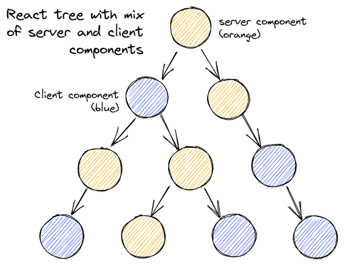
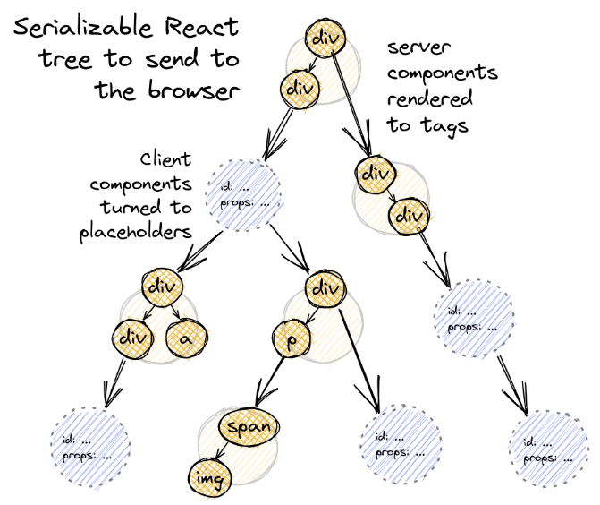
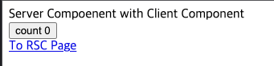
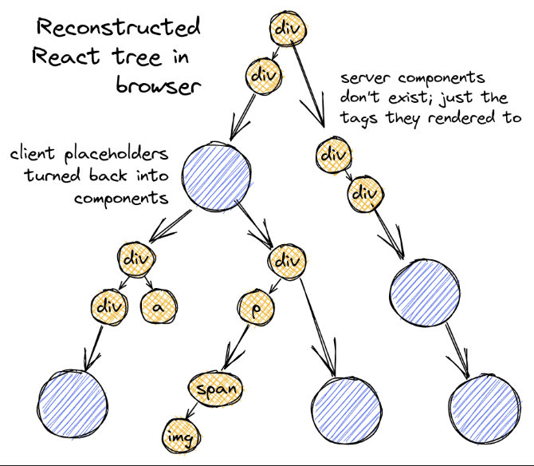

# RSC는 어떻게 Next.js에서 렌더링 되는가

## 기존의 컴포넌트는 어떻게 동작했는가

RSC의 등장으로 우리가 기존에 알고 있던 컴포넌트는 이제 **React Client Component**로 구분되기 시작했습니다. 기존의 컴포넌트는 데이터를 인자로 받아 JSX를 반환하는 자바스크립트 함수였습니다. 

전통적인 컴포넌트 렌더링 과정은 다음과 같습니다. 먼저 빌드 타임에서 Babel이 JSX를 만나 `React.createElement`로 변환합니다. 런타임에서는 각 컴포넌트가 호출되며 `React.createElement`가 실행되어 React Element라는 자바스크립트 객체를 반환합니다. React는 이 객체를 기반으로 Fiber(노드)를 생성하고 Fiber Tree를 구성하는데, 이것이 바로 Virtual DOM입니다. 마지막으로 React는 현재의 V-DOM과 이전 V-DOM을 비교(diff)하여 변화가 있는 부분만 실제 DOM에 반영합니다.

### RSC는 뭔가

**React Server Component**는 서버와 클라이언트가 함께 React 애플리케이션을 렌더링할 수 있도록 하는 기능입니다. React 컴포넌트 트리 내 일부는 서버에서 렌더링되고, 다른 컴포넌트는 브라우저에서 렌더링되며, 이를 통해 초기 페이지 로드 속도를 개선하고 자바스크립트 번들을 줄일 수 있습니다.



<br/>

### 그렇다면, SSR과 RSC는 무슨 차이가 있는가

RSC와 SSR은 전혀 다른 개념이다. 둘 다 "서버"라는 이름이 붙고 서버에서 수행되지만, 두 기능은 완전히 다른 개념으로 바라보는 것이 좋다. RSC를 사용한다고 해서 SSR이 필수적인 것은 아니며, 그 반대도 마찬가지다. 


#### RSC
RSC는 비상호작용적(non-interactive)인 UI 부분을 전적으로 서버에 두어 성능을 최적화하는 것을 목표로 합니다. React 트리의 일부 컴포넌트는 서버에서 렌더링되고, 다른 일부는 브라우저에서 렌더링됩니다. RSC는 서버가 데이터 가져오기 및 콘텐츠 렌더링에 집중하고, 클라이언트 컴포넌트가 상태 관리 및 상호작용성에 집중하게 하여 더 빠른 페이지 로드, 더 작은 자바스크립트 번들 크기 및 더 나은 사용자 경험을 제공합니


#### SSR
SSR (서버 사이드 렌더링): SSR은 서버에서 초기 HTML을 렌더링하여 초기 로드 시간을 개선하고 검색 엔진 최적화(SEO)를 향상시키는 데 중점을 둡니다. 서버 컴포넌트와 클라이언트 컴포넌트를 구분하지 않고 동일하게 렌더링합니다. 그런 다음 이 HTML과 클라이언트 측 React 코드를 브라우저로 보내 하이드레이션(hydration) 및 상호작용성을 제공합니다

<br/>
<br/>
<br/>

# Next.js App Router의 렌더링과정을 알아보면

먼저 Next.js App Router에서는 RSC와 Client Component(RCC)가 함께 동작하며
SSR(Server Side Rendering) 과정과 함께 렌더링된다.

<br/>


### 1. (on Server) RSC를 렌더링하여 **RSC Payload**라는 JSON 형태로 포맷
페이지 요청이 오면, Next 서버는 페이지 루트부터 순회하며 RSC를 렌더링하여, JSON 포맷의 **RSC Payload**로 만든다.


아래 처럼 컴포넌트 트리가 구성되었다면,
```jsx
const ClientComponent = ({text}) => <span>{text}</span>
const ServerComponent = () => <div>Server Component<ClientComponent text="With ClientComponent" /></div>

export default function RootPage(){
  return (
    <ServerComponent />
  )
}
```

payload는 아래와 같다.
```json
{
  "M1":{"id":"./src/ClientComponent.tsx", "chunks":["asdasdads"], "name":""},
  "children":[["$","span",null,{"children":["Server Compoenent",["$","$L5",null,{"text":" with Client Component"}]]}]]
}
```

Next.js는 컴포넌트 트리를 순회하다가 클라이언트 컴포넌트를 만나면 이를 placeholder로 처리하게 되는데, 
RSC Payload안에, **클라이언트 컴포넌트가 렌더링 될 위치** 와 **어떤 자바스크립트 파일인지** 를 알려주는 Placeholder 정보가 들어간다.
또, 서버 컴포넌트가 **클라이언트 컴포넌트로 넘겨줄 props 정보**와 **RSC의 렌더링 결과물**도 포함된다.

initial load 때는 HTML을 생성하기 때문에, 초기 진입하는 페이지의 rsc? 네트워크 요청은 볼 수 없을 것이다. 
RSC가 모두 HTML로 prerender 되기 때문이다. 
대신 Link 컴포넌트를 활용한 페이지가 prefetch 되면서 불러오는 rsc 요청이 보일것이다. 
자세한 것은 다음 과정에서 설명한다.
 

> Client Component 안에 Server Component를 쓰고싶다면 ?
> - Client Component 안에서 직접 Server Component를 임포트하여 리턴하면, 함께 placeholder로 처리되므로
> - `<ClientComponent><ServerComponent/></ClientCompoent>` 형태로 작성하여 Next.js가 RSC에 접근 가능하도록 만들어줘야한다.

<br/>

### 2. (on Server) HTML을 prerender(SSR) 한다.

RSC Payload와 Client Component Javascript Instructions를 이용하여 초기 HTML을 prerender한다. (SSR이 동작한다.)
물론 Client Component는 placeholder로 처리된다. 



하지만 위에서 말했든, SSR은 Client Component, Server Component를 가리지 않는다. 
그래서 `use client` 디렉티브가 붙은 컴포넌트도 SSR 과정에서 일부 HTML을 생성하게 된다.

```jsx
"use client"

const ClientComponent = () => {
  const [state, setState] = useState(0)

  return <button onClick={()=>setState(prev=>prev+1)}> Count {state} </button>
}
```
위와 같은 코드도 HTML을 보면 

Count 0 이라는 글자로 함께 로드된 것을 볼 수 있다.

useState의 디폴트 값이나, 일반 텍스트 같은 부분은 React API를 활용하여, HTML로 함께 prerender 된다. 
그러나 setState와 같은 것은 javascript로 따로 브라우저로 로드되며 추후 hydration을 거쳐서 인터랙티브하게 된다.

<br />


### 3. (on Client) HTML 즉시 렌더링

클라이언트에서는 Next 서버가 내려준 HTML을 즉시 렌더링한다. 
물론 이때 Client Component 대부분은 placeholder로 빠진 HTML이다.

초기 로드에만 HTML이 내려온다.


<br/>

### 4. RSC와 RCC를 Reconcil
클라이언트에서는 받은 RSC Payload와 SSR 이후 따로 내려받은 js파일로 placeholder로 처리된 부분을 실제 클라이언트 컴포넌트로 채우는 과정을 진행하게 된다. 즉, RCC와 RSC가 조합된 React Component Tree(V-DOM)을 만들게 된다.



<br/>

### 5. Hydration

이제 클라이언트 컴포넌트가 인터랙션이 가능해지도록 받은 JS 파일로 하이드레이션을 수행한다.

<br/>

### 6. Navigation

초기 로드 이후 HTML 없이 페이지 이동이 이뤄진다.
페이지 이동 전 Link 컴포넌트를 통해 연결된 페이지의 RSC Payload를 **prefetch**하게 되는데, 이때 rsc 관련 네트워크 요청이 발생한다.
페이지를 이동하게 되면, 미리 받아둔 RSC Payload

<br/>
<br/>
<br/>

## Suspense와 Streaming

React Suspense는 컴포넌트가 Promise를 반환할 수 있도록 허용하며, Promise가 아직 처리되지 않은 상태일 때는 **fallback UI**를 표시하고 렌더링 트리 순회를 계속합니다. 일반적인 Suspense는 클라이언트 중심으로 동작하며, 비동기 데이터를 기다리는 동안 사용자가 볼 수 있는 임시 UI를 제공하는 방식입니다.

Next.js에서는 `route segments`와 `suspense` 기준으로 렌더링 작업을 분리한다. 
위 기준으로 청크가 분리되며, 
페이지 로드시 헤더가 먼저 도착하고, HTML 본문을 청크단위로 점진적으로 전송한다고 하는데 

Next 15에선 갑자기 streaming이라는 단어가 안보이고 ppr로 나오네 뭐지. ?


### 참고 자료
- [Plasmic 블로그: How React Server Components Work](https://www.plasmic.app/blog/how-react-server-components-work)
- [Next.js 공식 문서: Server and Client Components](https://nextjs.org/docs/app/getting-started/server-and-client-components#how-do-server-and-client-components-work-in-nextjs)
