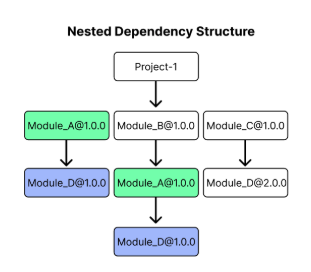
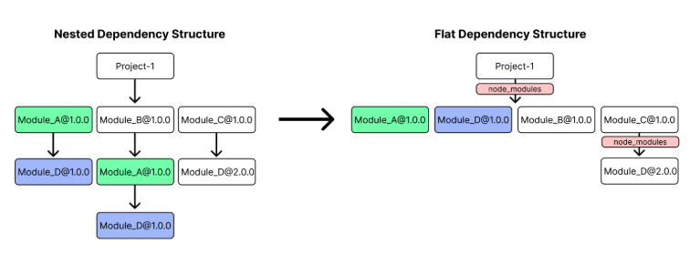
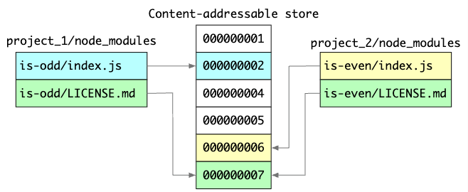

# 우리가 사용하고 있는 pnpm에 대해..

pnpm을 보기 전에, 왜 npm에서 pnpm과 같은 다른 패키지 매니저를 찾게되었는지 알아보려고한다.

npm은 Node.js용으로 패키지를 설치하고 관리할 수 있는 도구를 만들기 위해 2010년에 등장했다. npm 이전에는 패키지를 수동으로 복사하거나 git 저장소를 클론해서 의존성을 설치하는 등, 버전관리나 다른 사람이 만든 라이브러리를 공유하기 어려웠기 때문에 npm의 등장은 센세이션이었다.

## 왜 NPM의 대안을 찾게 되었을까?

NodeJS의 기본 패키지 매니저로 npm이 있었는데 pnpm이 등장하게 되었을까?

### 1. npm의 디스크 공간, 설치 속도 문제

npm(v2 이전)은 `Nested Dependency Structure`라는 구조로 의존성을 관리하는데



그림에서 보듯, Module_A@1.0.0을 직접 사용하고 있으면서, Module_B@1.0.0에서도 하위 의존성으로 Module_A@1.0.0을 두고 있다. 동일한 의존성이지만 npm은 Module_A@1.0.0을 두 번 설치한다. 마찬가지로 Module_D@1.0.0도 2번 설치된다.
이렇게 중복된 모듈이 있는 만큼 CI에서 의존성 설치 시간도 오래걸리게 되었다.

<br/>

### 2. 개선하려고 했는데... Ghost Dependency(유령 의존성) 문제 등장

npm에서는 모듈 중복 문제를 해결하기 위해 `npm v3`부터 의존성 트리를 평탄화하려고 했고 `hoisting`을 도입했다. 먼저 중복이 되는 의존성은 node_modules의 최상단으로 끌어올리고, 어떤 의존성에게 필요한 중첩된 하위 의존성은 그냥 루트에 있는걸 공유했다. 그 결과로 `Nested Dependency Structure`에서 `Flat Dependency Structure`가 되었다.



평탄화된 의존성으로 디스크 공간 절약과 설치 속도의 감소라는 이득은 얻었지만.. 부작용으로 하위 의존성으로만 존재하던 의존성이 여러번 사용된다고 최상위까지 올라오게 되며 `Ghost Dependency` 라는 문제가 나타났다.

```json
{
  // 내 pacakge.json
  "dependencies": {
    "pacakge-a": "^1.0.0",
    "pacakge-b": "^2.0.0"
  }
}
```

```
// 하위의존성
package-a
└── lodash (내가 직접 설치한 건 아님!)
package-b
└── lodash (내가 직접 설치한 건 아님!)
```

package-a와 package-b가 하위 의존성으로 lodash를 가지고 있었을 때
내가 직접 설치하지 않은 의존성에 대해 import 할 수 있게 된 것이 `Ghost Dependency`다.

```js
import _ from "lodash";
```

내가 명시하지도 않은 라이브러리를 실수로 import해서 사용 했을 때, 만약 package-a의 내부 구조가 바뀌면서 lodash가 필요하지 않게 되었다면, 우리 프로젝트에서 lodash는 호이스팅 되지 않을 것이고 우리 프로젝트는 import할 수 없다고 에러를 내게 된다는 문제점이 있다.

누가 먼저 설치되었는지, 어떤 버전 충돌이 있었는지에 따라 호이스팅이 될수도 있고 안될 수도 있다.
그래서 로컬환경에선 정상 동작하던 것이 CI 환경에서는 import할 모듈을 찾지 못한다는 등 큰 문제가 발생하게 될 가능성이 있다.

또, 여러 패키지가 다른 버전 의존할 경우 어떤 버전이 올라올지 예측이 불가능했다.
pacakge-a가 lodash v1을, package-b가 lodash v2를 사용한다고 했을 때,
호이스팅되는 것이 v1인지 v2인지 알수가 없다. package-b가 v1을 사용하게 되어 예기치못한 버그를 만들 수도 있었다.

> 하위의존성에 있는 의존성이 루트로 올라갔는데, 어떻게 상위 의존성은 하위 의존성을 식별할 수 있었을까?
>
> - NodeJS는 의존성을 현재 프로젝트에서 못찾으면 상위로 올라가서 탐색하는 resolution 알고리즘을 가지고 있기 때문에 가능했다.
> - project-b 내부의 `require('lodash')`는 상위로 올라가서 가져오게 된다.

개발자들은 이런 예측 불가능한 상황을 만드는 npm을 떠나 대체제를 찾게 되었다.

<br/>
<br/>
<br/>

# pnpm


npm의 단점을 극복하고자 2017년에 등장한 패키지 매니저로 Content-Addressable Store라는 개념을 도입했다. 축약해서 pnpm-store는 기기마다 하나씩만 존재하며, `프로젝트가 달라도` 재설치를 하지 않는다. 동일한 의존성이라면 프로젝트의 node_modules에서 `하드링크`로 store에 있는 의존성을 연결해서 쓴다.
즉 파일복사도 아니며, 여러 프로젝트에서 같은 물리파일을 참조한다.

기존 npm에서는 하위 의존성으로 lodash가 100번 사용된다면, 100번을 설치했다면 (물론 v3에서는 버전이 같다면 하나만 설치되었을 것이다. 대신 유령의존성이 있었겠지만) pnpm은 머신에서 딱 한번만 설치된다는 뜻이다. 당연히 디스크 공간을 절약하며 중복도 제거된다.

또, lodash v1.0.0에서 1.0.1로 업데이트 될 때, 해당 의존성을 재설치하는 것이 아니라 변경된 파일만 저장하는 센스도 가지고 있다.

> 내 머신의 pnpm store는 어디있을까?
> `pnpm store path`를 들어가보자.

<br/>

### pnpm은 어떻게 동작하길래 빠를까?

pnpm은 의존성 설치속도에서부터 npm보다 2배 이상 빠르다고 알려져 있다. 설치는 설치지 왜 빨라졌을까?

pnpm은 다음과 같은 단계로 설치한다.

1. Dependency resolution : 무슨 패키지가 필요한지 알아보고, 내 스토어에 없다면 스토어에 다운로드한다.
2. Directory structure calculation : pnpm은 npm과 달리 평탄화를 하지 않는다. 트리구조로 의존성을 설치하기 때문에, 어떤 패키지가 무엇을 필요로하는지, 어떻게 의존성 트리를 만들지 계산한다.
3. Linking dependencies : 설계도에 따라 node_modules를 만들고 필요한 패키지를 하드링크로 연결한다. node_modules는 스토어 어디를 가리킬지의 역할만 하게 된다.

이 단계는, 기존의 의존성식별 -> 다운로드 -> 파일쓰기 방식보다 훨씬 빠르다.

<br/>

### pnpm은 어떻게 유령의존성을 극복했나? hard-link 뿐만 아니라, sym-link도 쓴다.

```
node_modules/
├── pacakge-a/
├── package-b/
├── lodash/ → lodash는 package-a, package-b의 하위의존성에 불과함
```

npm에서는 내가 설치하지 않은 lodash도 호이스팅되어있어, require 덕분에 의존성을 가져다 쓰는 것이 가능했다. (유령의존성)

pnpm은 Node.js의 require 모듈 해석 방식을 그대로 따르면서도, 유령 의존성을 방지하기 위해 의존성 트리를 평탄화하지 않는 전략을 선택했다. 이때 디렉토리 구조의 연결을 위해 `symbolic link`를 사용했고, 그 결과 node_modules 트리는 복잡해졌지만, 명확하고 안전한 의존성 격리를 달성할 수 있었다.

```
node_modules/
├── package-a  →  .pnpm/package-a@1.0.0/node_modules/package-a  (symlink)
├── package-b  →  .pnpm/package-b@1.0.0/node_modules/package-b  (symlink)
├── .pnpm/
│   ├── package-a@1.0.0/
│   │   └── node_modules/
│   │       ├── package-a/ (hardlink)
│   │       └── lodash@4.17.21/ (hardlink)
│   ├── package-b@1.0.0/
│   │   └── node_modules/
│   │       ├── package-b/ (hardlink)
│   │       └── lodash@3.10.1/ (hardlink)
```

pnpm은 내가 설치한 의존성들은 루트에 올려두고, 하위 의존성들을 격리하기 위해
`.pnpm`이라는 폴더 하위에 각 패키지별로 독립된 node_modules 구조를 구성하고, 그 안에 하위 의존성을 배치한다. 상위에 있는 package-a는 .pnpm의 package-a를 가리키는 심링크로 구성되어 실제 동작은 .pnpm에서 이뤄진다.

따라서 .pnpm 의 package-a에서 lodash를 불러올 때, 자신의 node_modules에서 lodash를 찾을 수 있으므로 각 require의 기본 동작을 유지하면서도 의존성이 꼬이는 일을 피할 수 있었다.

> 정리
> .pnpm/ 내의 파일들은 실제로 pnpm store의 파일과 inode가 같은 하드 링크이며,
> node_modules는 그 .pnpm 디렉토리를 symlink로 가리켜 Node.js의 require 탐색 경로와 호환되도록 한다.

<br/>

### Standalone 빌드할 때, 마주한 문제점

standalone build 또는 self-contained build는:
Node.js 앱을 특정 디렉토리 또는 zip/tar 파일로 묶어서
실행 환경에 그대로 복사하거나 배포하는 방식입니다.
이때 node_modules도 함께 포함시켜야 합니다.

`pnpm`은 의존성 파일을 `.pnpm-store`에 한 번만 저장한 뒤, 각 프로젝트의 `.pnpm/` 디렉토리에 하드링크로 연결하고, 루트 node_modules에는 symlink로 연결하는 구조에서
`standalone build`시 `.pnpm-store`가 누락되면, 하드링크의 원본이 사라져 모듈을 `require()`할 수 없게 된다. 그래서 보통 Module Not Found 에러를 마주하게 된다.

즉, **하드링크라서가 아니라 원본을 안 가져갔기 때문에 생기는 문제입니다.**

#### 해결 방법:

1. **번들러 사용(ncc, Vite 등)** – 의존성을 하나로 묶어 `.pnpm` 구조와 무관하게 만듦
2. **pnpm deploy** – 애플리케이션을 배포할 때 사용하도록 고안된 기능으로, store 없이 실행 가능한 node_modules 생성해주는 기능이다
3. **Docker 내부에서 설치** – 런타임 환경에 맞게 store와 링크 구조 유지

갓빌리는 pnpm deploy로 해결했다.

> References
>
> - https://pnpm.io/motivation
> - https://pnpm.io/blog/2020/05/27/flat-node-modules-is-not-the-only-way
> - https://po4tion.dev/pnpm
