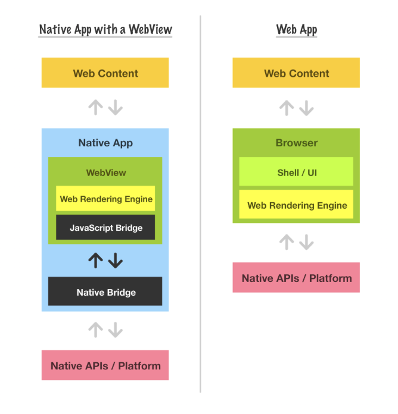

# 하이브리드 앱과 웹뷰: 웹과 앱의 경계에 선 기술

모바일 앱 개발은 기술 선택에 따라 크게 세 가지 방식으로 나뉜다.  

1.  **네이티브 앱**이다. 플랫폼에 최적화된 언어(iOS는 Swift, Android는 Kotlin 등)를 사용하며, 가장 깊이 있는 OS 기능 접근과 최고 수준의 성능을 제공한다. 하지만 이 방식은 이중 개발 부담, 긴 테스트 주기, 그리고 앱 심사 지연 등 여러 제약을 동반한다.
2. 두 번째는 **크로스 플랫폼 앱**이다. 하나의 코드베이스로 iOS와 Android를 동시에 지원하는 방식이며, 대표적으로 React Native와 Flutter가 있다. 이 방식은 효율적인 개발과 일정 수준의 네이티브 UX 제공이 가능하지만, 프레임워크 자체의 제약이나 각 플랫폼별 디테일한 구현 차이로 인해 기술적 제한이 존재한다.
3. 세 번째는 **하이브리드 앱**이다. 웹뷰를 활용해 네이티브 앱 안에 웹 콘텐츠를 삽입하는 방식이다. 네이티브와 웹의 절충안처럼 보이지만, 단순한 타협이 아닌 전략적 선택이 될 수 있다.

사용자는 빠른 속도와 매끄러운 UX를 기대하고, 서비스 제공자는 자주 업데이트하면서도 플랫폼 간 호환성을 확보하길 원한다. 이 상충하는 요구를 절묘하게 조율하는 선택지 중 하나가 바로 **웹뷰(WebView)** 기반의 **하이브리드 앱**이다. 


<br/>


### Webview와 Browser의 차이는 뭘까 ?



웹뷰는 모바일 앱 내에서 웹페이지를 렌더링할 수 있게 해주는 구성 요소로, 겉으로 보기에는 단순히 웹을 띄우는 창처럼 보이지만 실제로는 브라우저와 유사한 구조를 가진 독립된 렌더링 환경이다. 

iOS에서는 WebKit 기반의 WKWebView가, Android에서는 Chromium 기반의 WebView로 웹뷰를 구현한다. 
iOS의 WebKit은 JavaScriptCore, WebCore, UIProcess, WebProcess, NetworkProcess 등의 모듈로 구성되어 있다.
반면, Android의 WebView는 Blink 렌더링 엔진과 V8 JavaScript 엔진 위에서 동작하며, Chrome 브라우저와 거의 동일한 구조를 따른다.

이들은 실제 Safari나 Chrome 브라우저와 동일한 렌더링 엔진(WebKit, Blink)과 자바스크립트 엔진(JavaScriptCore, V8)을 사용하지만, 완전한 브라우저는 아니다. 예를 들어 주소창, 탭, 북마크 같은 브라우저 기능은 없으며, **쿠키나 localStorage, IndexedDB 등 저장소도 실제 브라우저와는 격리된 각 앱의 샌드박스 내에 존재**한다.

우리는 현재 React Native 기반으로 앱을 개발하고 있으며, 그 안에서 웹 콘텐츠를 렌더링하기 위해 `react-native-webview`를 사용하고 있다. 이 컴포넌트는 iOS의 WKWebView와 Android의 WebView를 네이티브 단에서 감싸는 래퍼 역할을 하며, JavaScript에서 웹뷰를 제어할 수 있도록 다양한 브리지 기능을 제공한다.

<br />

### 웹뷰를 선택하는 이유

- **빠른 배포와 실험 가능성**  
  웹뷰의 가장 큰 장점 중 하나는 기능 변경 사항을 실시간으로 반영할 수 있다는 점이다. 웹은 서버에 코드를 배포하는 즉시 모든 사용자에게 동일하게 적용되지만, 네이티브 앱은 앱스토어의 심사를 통과해야만 변경사항이 반영된다. 이 과정은 며칠에서 길게는 1~2주가 걸리기도 하며, 실험적 기능을 시도하거나 긴급한 이슈에 대응하기에 매우 비효율적이다. 반면 웹뷰 기반 앱은 웹 콘텐츠만 수정하면 되기 때문에, 배포 속도 면에서 압도적인 민첩성을 제공한다.

- **멀티 플랫폼 대응의 효율성**  
  하나의 웹 페이지로 Android, iOS, 모바일 브라우저, 데스크톱 브라우저까지 아우를 수 있다는 점은 웹뷰의 또 다른 강점이다. 이를 통해 플랫폼별로 UI를 별도로 관리하지 않아도 되고, 프론트엔드 개발자가 하나의 코드베이스만으로 다양한 사용자 환경을 커버할 수 있다. 특히 반응형 웹을 잘 설계하면 사용자에게도 일관된 UI/UX를 제공할 수 있어 유지보수와 확장성이 모두 뛰어나다.

- **앱 설치 용량 감소**  
  웹뷰 앱은 핵심 UI와 리소스를 네이티브 앱 내부에 포함하지 않고, 서버에서 로드하는 구조를 택한다. 이 때문에 설치 파일 자체가 매우 가벼워질 수 있고, 실제로 10MB 미만의 앱도 충분히 구현 가능하다. 이는 특히 데이터 사용량에 민감한 사용자나 로엔드 기기를 사용하는 사용자에게 매력적인 선택이 될 수 있다. 앱 설치 허들이 낮아지면 다운로드 전환율에도 긍정적인 영향을 준다.

- **네이티브 기능의 부분 활용 가능성**  
  웹뷰라고 해서 네이티브 기능을 전혀 못 쓰는 것은 아니다. 앱 개발자는 React Native WebView와 같은 브리지 시스템을 통해 웹뷰 내에 위치 정보, 카메라 접근, 파일 업로드, 푸시 알림 등의 네이티브 기능을 제한적으로 노출할 수 있다. 필요한 기능만 선택적으로 구현할 수 있어 전체 앱 구조를 단순화하면서도 사용자 경험을 일정 수준 이상으로 유지할 수 있다.

- **SEO 친화적 콘텐츠 구성 가능성**  
  커머스나 블로그, 뉴스 앱처럼 콘텐츠 중심의 서비스는 검색 엔진 최적화(SEO)가 중요한데, 웹뷰를 통해 렌더링되는 웹 페이지는 기본적으로 HTML 기반이므로 구글, 네이버 등의 검색 엔진에 노출될 수 있다. 이는 네이티브 앱에서 구현하기 어려운 검색 유입 채널을 확보할 수 있다는 뜻이며, 마케팅과 사용자 유입 측면에서 유리하다.

- **프론트엔드 기술만으로도 앱 콘텐츠 개발 가능**  
  웹뷰 내에서 렌더링되는 콘텐츠는 HTML, CSS, JavaScript로 구성되기 때문에, 프론트엔드 개발자는 별도의 앱 개발 지식 없이도 앱 내 기능을 개발하고 배포할 수 있다. 기존에 웹 기반 서비스만 운영하던 팀도 쉽게 앱 환경으로 확장할 수 있어, 인력 구성과 기술 투자 면에서도 효율적이다. 이는 특히 스타트업이나 소규모 팀에게 큰 이점이 될 수 있다.


<br/>
<br/>
<br/>

## 현실의 벽: 웹뷰가 마주한 기술적 제약과 고려사항

웹뷰는 완벽하지 않다. 

#### 1. 브라우저와는 다른 UI/UX 경험

웹뷰는 화면 전환, 스와이프 제스처, 네이티브 애니메이션 등에서 브라우저나 네이티브 앱에 비해 이질감이 발생할 수 있다. 예를 들어, 화면을 전환할 때 화면이 깜빡이거나 iOS의 내비게이션 제스처(예: 왼쪽 끝에서 오른쪽으로 스와이프)가 기본적으로 지원되지 않아 전체 앱의 일관된 UX를 해치기 쉽다.
- `React-Native-Webview`에선 `allowsBackForwardNavigationGestures` props로 스와이프 백을 지원할 수 있다. 그러나 웹에서 클릭을 통한 라우팅시 네이티브 앱처럼 Drawer형태로 페이지 전환이 이뤄지진 않는다. 이것을 구현하려면, 라우트 이동을 막고 브릿지로 앱에서 라우팅하도록 만들어야 한다.

<br/>

### 2. 백그라운드에서의 타이머, 백그라운드 Task 제약

브라우저에서는 `setTimeout`, `setInterval`과 같은 타이머가 백그라운드 상태에서도 일정 수준 동작하지만, 모바일 앱은 OS가 리소스를 제한하기 때문에 앱이 백그라운드로 진입하면 해당 타이머가 정지된다. 특히 실시간으로 상태를 갱신해야 하는 UI나 채팅 기능이 동작하지 않는 문제가 발생한다.
- 필요 시 React Native의 백그라운드 Task 처리 라이브러리(`react-native-background-fetch`, `react-native-background-timer` 등) 활용.
- 가능한 범위 내에서 푸시 알림 또는 서버 폴링 방식으로 대체.

<br/>

### 3. 프로세스 소멸 & 흰 화면 (Blank Screen)

특히 iOS의 `WKWebView`는 내부적으로 UIProcess, WebProcess, NetworkProcess로 구성되며, 시스템 메모리 압박이나 렌더링 에러 등으로 인해 WebProcess가 죽는 일이 발생한다. 이 경우 앱은 아무런 경고 없이 빈 흰 화면만 보여주는 치명적인 UX 문제가 발생한다. Android도 마찬가지로 WebView의 렌더링 프로세스가 사라질 수 있다.
- iOS: `React-Native-Webview`의 `onProcessDidTerminate` 핸들러로 프로세스 종료 시 웹뷰를 리로드해야한다.
- Android: `onRenderProcessGone` 핸들러로 프로세스 종료 시 웹뷰를 리로드해야한다
- 단, 너무 자주 reload 하지 않도록 재시도 횟수를 제한하거나, 사용자에게 에러 메시지를 명확히 제공하는 것이 좋다.

<br/>


### 4. Splash Screen과 초기 로딩 문제

웹뷰는 네이티브가 아닌 웹 콘텐츠를 서버에서 불러오기 때문에 첫 로딩 시 흰 화면이 표시되는 경우가 많다. 특히 서버 응답이 느릴 경우 이 공백은 더욱 길어진다. 이는 앱 품질에 대한 인상을 크게 떨어뜨릴 수 있다.
- React Native WebView를 감싸는 컴포넌트 위에 Lottie 또는 이미지 기반 스플래시 스크린을 띄워두고, `onLoadEnd` 이벤트에서 제거.
- CDN을 활용하여 웹 응답 속도를 줄이는 것도 병행하면 효과적.

<br/>

### 5. Heuristic Caching

HTTP 응답에 `Cache-Control` 헤더가 빠져 있더라도, 브라우저 엔진은 자체적인 **휴리스틱 캐싱**(Heuristic Caching)을 수행한다. 이는 동일한 URL이라도 최신 데이터가 아닌 이전 데이터를 보여주는 원인이 되며, 특히 상품 리스트나 공지사항 등 실시간성이 중요한 페이지에서 문제를 유발할 수 있다.
- 요청 헤더에 반드시 `Cache-Control: no-store`와 같이 캐시를 무효화는 헤더를 추가해야한다.
- 경우에 따라 `ETag` 및 `Last-Modified` 헤더를 함께 활용하여 캐시 무효화.


<br/>

### 6. 네이티브 기능 연동 이슈

React Native WebView는 네이티브 기능을 직접 제공하지 않기 때문에, 앱과의 통신을 위해 브릿지를 사용해야 한다. 이 과정에서 다음과 같은 문제들이 발생할 수 있다.

- **뒤로가기 버튼 제어 (Android)**  
  기본적으로 Android의 하드웨어 back button을 누르면 앱이 종료되거나 WebView를 벗어날 수 있다.
  Webview의 onNavigationStateChanged를 감지하여 현재 히스토리를 파악해서 백키를 제어해야한다.

- **네이티브 API 업데이트 대응**  
  웹에서 사용하는 네이티브 기능(예: 위치, 푸시, 카메라 등)이 업데이트되면, 해당 브릿지를 사용하는 앱도 같이 업데이트되어야 한다. 하지만 웹은 바로 배포되지만 앱은 배포 딜레이가 있으므로, 버전 불일치로 인한 오류가 발생할 수 있다. 쿠키나 브릿지를 통해, 웹에서 앱 버전을 읽어 로직을 분기하여 하위호환을 처리해야된다. 하위호환이 되지 않는 경우엔 앱 업데이트 페이지로 유저를 보내야한다.


<br/>

### 7. 디버깅의 어려움 (특히 iOS)

과거에는 iOS에서 웹뷰 디버깅이 매우 제한적이었다. 개발자 계정에 등록된 디바이스에서만 Safari Inspector 연결이 가능했고, 회사 단위 계정에서 디바이스 등록 수가 제한되어 불편함이 컸다. 테스트 기기를 빌리거나, 직접 Xcode로 앱을 빌드해 디버깅해야만 했다.
- iOS 16.4부터는 TestFlight 버전에서도 인스펙터 사용 가능.
- console.log를 오버라이드하여 웹에서 발생하는 콘솔을 브릿지를 통해 앱으로 전달하는 것은 크게 도움된다.

<br/>

### 8. 앱 심사 주의점

- 앱이 단순히 웹사이트를 감싸는 형태(PWA처럼 보이는 경우)로 보이면 리젝될 수 있으므로, 네이티브 기능이나 UI 요소가 반드시 포함되어야 한다.
- 카메라, 위치 등의 권한을 요청할 때는 구체적인 목적을 설명해야 하며, "활동을 위해"와 같은 추상적인 표현은 리젝 사유가 된다.
- 네트워크 연결이 불안정할 경우 사용자에게 에러 메시지나 재시도 버튼 등의 안내 UI가 필요하며, 빈 화면이나 앱 종료 현상은 허용되지 않는다.
- 앱에서 크래시가 발생하거나 심사 중 기능이 제대로 작동하지 않으면 즉시 리젝되며, 코드 푸시나 배포 자동화 도중 생긴 버그도 포함된다.
- 리뷰, 댓글, 신고, 차단 등 사용자 생성 콘텐츠(UGC)가 있는 경우, 이를 관리하기 위한 정책과 기능(예: 신고/차단 버튼 등)이 필수로 포함되어야 한다.
- 카카오, 구글 등의 소셜 로그인만 제공할 경우 리젝될 수 있으며, Apple 로그인을 반드시 함께 제공해야 하며 Apple의 디자인 가이드라인을 준수해야 한다.
- 사용자 주소, 전화번호 등 민감한 개인정보를 요청할 경우에는 수집 목적과 필요성을 명확히 설명해야 한다.
- 앱에 "test", "dev", "http", "admin" 등 테스트용 단어가 포함되거나, 더미 데이터가 표시되는 경우 리젝될 수 있으므로 실제에 준하는 데이터를 사용해야 한다.
- 앱스토어에 등록하는 미리보기 이미지에 Android 아이콘이나 Android 기기 프레임이 포함될 경우 디자인 가이드 위반으로 리젝될 수 있으며, Apple의 Human Interface Guidelines를 반드시 참고해야 한다.


<br />
<br />
<br />

## 웹과 앱의 소통은 어떻게 이루어지는가

웹뷰는 웹이지만, 앱 내부에 포함된 웹이다. 즉, 독립적인 웹 콘텐츠가 아니라 **앱의 생태계 안에서 실행되는 웹**이다. 이로 인해 웹과 네이티브 앱 간의 통신은 필수적이며, 그 구조를 명확히 설계하지 않으면 유지보수와 기능 확장에서 큰 어려움을 겪게 된다.

가장 대표적인 통신 방식은 `postMessage` 기반이다.  
웹에서는 `window.ReactNativeWebView.postMessage(data)`를 호출해 메시지를 앱으로 보낼 수 있다. 앱에서는 React Native 기준으로 `<WebView onMessage={handler} />` 형태로 메시지를 수신한다.

반대로 앱이 웹에게 메시지를 보낼 때는 `injectJavaScript()`를 사용해 웹에 직접 스크립트를 주입하거나, `webviewRef.current.postMessage()`를 통해 메시지를 전달할 수 있다.  

단, 여기서 중요한 점은 **플랫폼별 차이**이다.  
iOS의 경우, 앱에서 웹으로 메시지를 보내기 위해 `window.webkit.messageHandlers.<handlerName>.postMessage(data)` 형태를 사용한다.  
Android는 `document.addEventListener('message', handler)`를 통해 메시지를 수신하며, 웹에서 `window.postMessage(data)`로 메시지를 전달할 수 있다.
즉, 웹뷰 상에서 동일한 메시징 로직을 구현하더라도, 플랫폼마다 통신 객체의 구조가 다르므로 반드시 **User-Agent를 통한 분기처리**가 필요하다.

한편, 앱 스킴(App Scheme)을 활용한 통신도 존재한다. 예를 들어, `myapp://action?title=Hello&author=GPT`와 같은 URL을 웹에서 열어 앱이 이를 감지하도록 하는 방식이다. 하지만 이 방법은 다음과 같은 한계가 있다:
- URL 길이에 제한이 있으며(일반적으로 2~3KB),
- 연속 호출 시 이전 호출이 취소될 수 있고,
- 바이너리 데이터를 주고받기엔 부적절하다.

하이브리드 앱에서는 보통  **JavaScript Interface 방식**을 선호한다.  
이는 앱에서 사전에 정의해둔 JS 함수를 웹에서 직접 호출하는 방식이며, 두 가지 형태로 매개변수를 전달할 수 있다.
- 레거시 방식: `myFunc(arg1, arg2)`처럼 인자의 순서에 의존한다.
- 현대적 방식: `myFunc({ key1: val1, key2: val2 })`처럼 JSON 객체로 전달하는 방식으로 유지보수 측면에서 유리하며, 파라미터가 변경되더라도 인터페이스 변경 없이 확장 가능

<br/>

#### 보안을 위해, 지양해야하는 통신방식

보안과 유지보수 관점에서 가장 주의할 점은 **웹에서 동적으로 콜백 함수를 정의하여 통신하는 방식은 지양**해야 한다는 것이다.   
예를 들어 아래와 같은 패턴은 지양해야 한다.
```js
// 웹에서 콜백 등록
window['someCallback_' + Math.random()] = function (data) {
  console.log('앱이 준 응답:', data);
};

// 앱에 전달
window.ReactNativeWebView.postMessage(JSON.stringify({
  action: 'doSomething',
  callback: 'someCallback_0.123456',
}));
```
```js
// 웹뷰에 JS 주입
webView.injectJavaScript(`
  window['someCallback_0.123456'](${JSON.stringify(result)});
`);
```
이처럼 문자열로 구성한 콜백 이름을 앱이 실행하도록 설계하면, 악성 스크립트가 삽입될 경우 흔히 말하는 **XSS(크로스 사이트 스크립팅)** 공격의 진입점을 만들 수 있기 때문이다.
또한 런타임에서 정의된 콜백은 디버깅과 유지보수에도 불리하다.
위에 적혀있듯 Javascript Interface방식을 사용하는것이 가독성과 확장성이 좋다.

---


<br/>

다음 글에서는 이 구조를 기반으로, `async/await`을 활용한 **Promise 기반 브릿지 통신 설계**를 소개할 예정이다.

<br/>

> **References**
> - https://github.com/react-native-webview/react-native-webview/blob/master/docs/Guide.md
> - https://www.kirupa.com/apps/webview.htm
> - https://www.youtube.com/watch?v=Ecg52wAlYus
> - https://www.youtube.com/watch?v=LbU5E1pWfks
